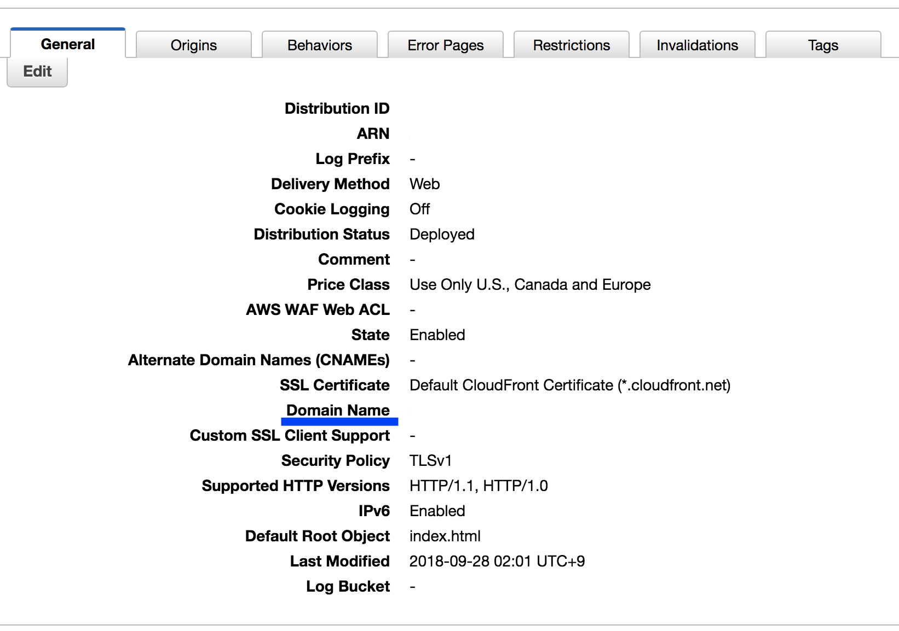

## 시작하기

`create-react-app` (이하 CRA)을 이용하면 손쉽게 `react`앱을 생성할 수 있습니다.

그렇게 열심히 앱을 개발했으면 인터넷 상에 우리 앱을 보여줘야겠죠? 그럴 때 필요한게 바로 호스팅입니다.

웹 서버에 앱을 호스팅하면 인터넷 상의 다른 이용자들이 우리 앱을 볼 수 있습니다.

`CRA`앱을 호스팅하려면 우선 `build` 명령어를 통해 필요한 파일을 `build` 디렉토리 아래에 준비시켜야합니다.

간단히 `npm run build` 명령어를 실행하는 것만으로도 최적화된 빌드 파일이 생성됩니다 :)

다음 단계는 AWS 서비스 준비입니다.

우리는 AWS의 S3에 빌드 파일을 업로드한 다음, [CDN](https://ko.wikipedia.org/wiki/%EC%BD%98%ED%85%90%EC%B8%A0_%EC%A0%84%EC%86%A1_%EB%84%A4%ED%8A%B8%EC%9B%8C%ED%81%AC) 서비스인 `C`loudfront`를 연결할 것입니다.

전체적인 모습은 아래와 같습니다.


[출처] aws 공식문서

서비스를 하나 하나 생성하고 설정하는 방법도 있지만 저는 게으른 사람이므로 더 간단한 방법을 찾았죠.

## Cloudformation?

Cloudformation은 AWS의 서비스를 매뉴얼하게 생성하고 관리하는 대신 template 파일을 통해 일괄적으로 관리할 수 있게 도와주는 서비스입니다.

`template` 파일은 `yaml` 혹은 `json` 의 두 가지 형식이 지원됩니다.

`json` 형식의 파일은 가독성이 떨어지고, 에러를 발견하기가 어렵기 때문에 `yaml` 형식을 권장합니다.

그러면 `react`앱 호스팅을 위한 `template` 파일을 한 번 살펴볼까요?

```yaml
# react-app-hosting-template.yaml
AWSTemplateFormatVersion: '2010-09-09'
Resources:
  ** Cloudfront distribution 이름 **:
    Type: AWS::CloudFront::Distribution
    Properties:
      DistributionConfig:
        DefaultCacheBehavior:
          AllowedMethods:
            - GET
            - HEAD
          Compress: true # gzip 압축 설정
          ForwardedValues:
            QueryString: false
          TargetOriginId: !Ref ** 버킷 서비스 명 **
          ViewerProtocolPolicy: redirect-to-https
        DefaultRootObject: index.html # entry
        Enabled: true
        Origins:
          - DomainName:
              Fn::GetAtt:
                - ** 버킷 서비스 명 **
                - DomainName
            Id: !Ref ** 버킷 서비스 명 **
            S3OriginConfig:
              OriginAccessIdentity: ''
        PriceClass: PriceClass_100
    DependsOn:
      - ** 버킷 서비스 명 **
  ** 버킷 서비스 명 **:
    Type: AWS::S3::Bucket
    Properties:
      BucketName: ** 버킷 이름 **
      WebsiteConfiguration: # 호스팅 관련 설정
        IndexDocument: index.html
        ErrorDocument: index.html
  ** 버킷 정책명 **:
    Type: AWS::S3::BucketPolicy
    Properties:
      Bucket: !Ref ** 버킷 서비스 명 **
      PolicyDocument: # 버킷의 파일을 다른 사람들이 읽을 수 있는 권한을 부여
        Statement:
          Sid: ReadAccess
          Action:
            - s3:GetObject
          Effect: Allow
          Resource:
            - arn:aws:s3:::** 버킷 이름 **/*
          Principal: '*'
```

`**`으로 감싸진 부분만 바꿔주시면 바로 사용할 수 있습니다.

[설명]

1. 모든 서비스는 필수적으로 `Type` 속성을 입력해줘야합니다.
2. `!Ref` 문법을 통해 다른 서비스를 참조할 수 있습니다.
3. `Fn::GetAtt`함수를 이용하면 다른 서비스의 특정 속성을 가져올 수 있습니다.
4. 설정 옵션은 Properties 아래에 위치합니다.
5. `!Ref`를 통해 버킷을 참조할 때는 ** 버킷 이름 **이 아니라 ** 버킷 서비스 명 **을 사용한다는 점 조심해주세요!
매우 기본적인 설정 파일이기 때문에 자신의 입맛에 맞게 설정 파일을 고치고 싶다면 [템플릿 레퍼런스 문서](https://docs.aws.amazon.com/AWSCloudFormation/latest/UserGuide/template-reference.html)를 참조해주세요.

위 문서에서 `AWS Resource Types Reference`으로 들어가면 여러 AWS 리소스의 설정 레퍼런스가 나옵니다.

어떤 속성이 필수 속성인지 또 어떤 속성을 변경해야하는지 꼭 확인을 해주시기 바랍니다.

또 설정을 변경한 경우 `template` 파일의 유효성 (문법, 필수 속성 누락 여부 등)을 검사해야할 필요가 있는데, `aws-cli`가 제공하는 기능을 사용할 수 있습니다.

```bash
# 파일이 위치한 디렉토리에서 아래 명령을 실행하면
aws cloudformation validate-template --template-body file://./react-app-hosting-cloudformation-template.yaml
```

```bash
# 아무 이상이 없을 경우:
{
    "Parameters": []
}
```

```bash
# 에러 발생:
An error occurred (ValidationError) when calling the ValidateTemplate operation: Template format error: [/Resources/mathAloneClientDistribution] Every Resources object must contain a Type member.
```

[더 알아보기]
[AWS 공식문서 - 템플릿 확인](https://docs.aws.amazon.com/ko_kr/AWSCloudFormation/latest/UserGuide/using-cfn-validate-template.html)

자 이제 파일에 아무 이상이 없다는 것을 확인했다면?

```bash
aws cloudformation deploy --stack-name ** 스택 이름 ** --template-file ** 내 스택 파일명 **
```

이제 조금 기다리시면 (15 ~ 30분 사이 정도였던 것 같아요...), 정상적으로 스택이 배포된 것을 확인할 수 있습니다.

## 확인하기

사이트가 정상적으로 호스팅되고 있는지 확인하려면 AWS 콘솔 - Cloudfront로 들어가서 `도메인 이름` 항목에 적힌 주소로 접속해보면 됩니다.



[출처] 내 컴퓨터

정상적으로 사이트가 보이시나요?

축하드립니다 !
