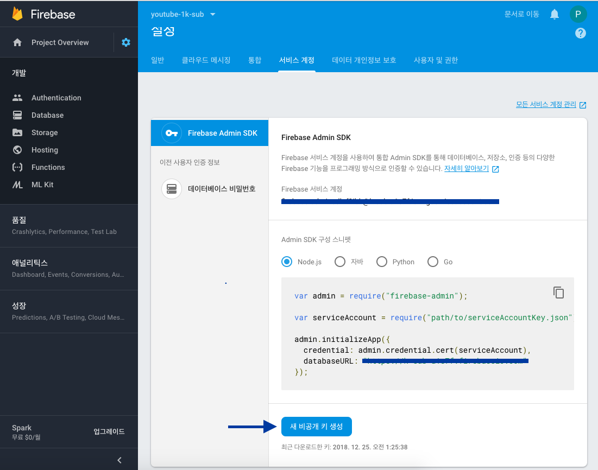
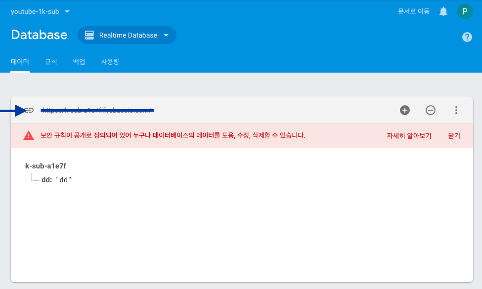
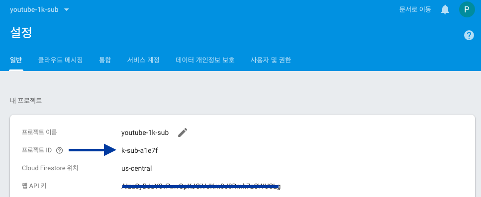

> This article was published on [Medium](https://medium.com/@leejh3224/testing-firebase-cloud-functions-with-jest-4156e65c7d29) before.


2019 is coming and 2019 would be the year of “Serverless”.

[Popularity of Serverless has grown rapidly](https://trends.google.com/trends/explore?date=today%205-y&geo=US&q=serverless).

However, it’s hard to properly setup and test functions due to lack of resources.

Of course, there are lots of articles for ‘How to start’ but not much for testing.

I believe many of you already know how much benefit TDD provides you with. So I’m not gonna repeat it here.

In this article, I’m gonna tell you how to setup your Firebase cloud functions and write unit test for them.

## Before We Start

I assume you already have at least one function.

If you’re not, then follow [official tutorial]((https://firebase.google.com/docs/functions/get-started)) to create a new project.

## Getting Started

Let me briefly explain about the function we’re going to create.

I’ll create some trigger for **user.onCreate** method. ([code](https://firebase.google.com/docs/functions/auth-events)).

This trigger function will save a newly authenticated user into our realtime database with several necessary properties for my simple game app.

First, look at the code below.

```js
/**
 * functions.auth.user().onCreate is triggered when
 * 1. register via email/password
 * 2. first logIn via 3rd party auth providers (Facebook, Google, etc)
 * 3. developer creates new account via Firebase Admin SDK
 * 4. first logIn as anonymousUser
 *
 * What this functions does is that when onCreate method is triggered,
 * we create `newUser` with necessary information including uid or displayName from given user
 * And then save it in our database
 */
export const onUserCreate = functions.auth.user().onCreate(user => {
  const dayInMs = 24 * 60 * 60 * 1000;

  // Think of this as user of simple game app
  // you have daily goals(quests) and you earn points by finishing them
  const newUser = {
    ...user,
    points: 0,
    questType: "kill_monster",
    questGoal: 30,
    questActual: 10,
    // valid for next 24 hours
    questValidUntil: Date.now() + dayInMs
  };

  return admin
    .database()
    .ref(`/users/${user.uid}`)
    .set(newUser);
});
```

Ok, check out what it is in detail. First, `onCreate` method accepts one parameter, `user`.

User is an object returned after authentication via email/password, anonymous auth, 3rd party auth providers, etc.

We can use this parameter to add new properties like above.

As I’m making a game app, I added properties like points and quest related ones.

Then I called `admin.database().ref(path).set` method to save our newly created user into database. (Exactly same process as using database with firebase SDK)

Simple enough, right?

However, if you try to test these trigger functions, then it will become a huge pain.

Because it is hard to setup client apps and manually iterate auth process.
(Click on auth button — type in email/password — wait for auth to finish — go to console and check our user is saved or not)

## Write Test

That’s where automated test shines.

You can repeat testing for many times without those hassles. All you have to do is just type test commands (`yarn test`) and iterate through “red/green” light process.

So let’s write a test for Firebase cloud functions. There are some example codes for [this](https://github.com/firebase/functions-samples/blob/master/quickstarts/uppercase/functions/test/test.offline.js) but this code sample uses Mocha and Chai.

As a lover of [Jest](https://jestjs.io/), I wanted to use Jest for my tests.

Ok, let’s setup jest into your project. I prefer to use Typescript for my projects so this setup may be little bit different if you use plain javascript, but there will not be great difference.

1. Add jest.config.js under your functions directory.

    ```js
    // this config includes typescript specific settings
    // and if you're not using typescript, you should remove `transform` property
    module.exports = {
        transform: {
            '^.+\\.tsx?$': 'ts-jest',
        },
        testRegex: 'src(/__tests__/.*|(\\.|/)(test|spec))\\.(jsx?|tsx?)$',
        testPathIgnorePatterns: ['lib/', 'node_modules/'],
        moduleFileExtensions: ['ts', 'tsx', 'js', 'jsx', 'json', 'node'],
        testEnvironment: 'node',
        rootDir: 'src',
    }
    ```

2. Create `__tests__` directory under src and add basic test file.

    ```js
    it("should pass", () => {
        // meaningless test
        expect(1).toBe(1);
    });
    ```

3. Download `Service-key` from firebase console.

    

    Go to settings and click on service account tab. You’ll find create new account key button below.

    Download this key and include in your project. (Don’t forget to include this file in your `.gitignore` file — keep your secrets safe!)

4. Add test command in your `package.json` file.

    ```json
    "scripts": {
        ...other commands
        // I prefer to set verbose=false, because it shows console.logs in terminal window. You can remove this flag.
        "test": "jest --watchAll --verbose=false"
    },
    ```

5. Install required dependencies.

    ```bash
    npm install jest @types/jest firebase-functions-test ts-jest -D
    ```

Now, you’re ready to go.

Write our test code to test our trigger function.

```js
import functions from "firebase-functions-test";
import * as admin from "firebase-admin";
import * as path from "path";

// you can check all these information in firebase console/settings
const projectConfig = {
  projectId: "projectId",
  databaseURL: "databaseURL"
};

// you should pass projectConfig and path to serviceAccountKey like this
// path.resolve defaults to directory where you're executing test command
// for my case, it's functions directory
const testEnv = functions(projectConfig, path.resolve("service-key.json"));
```

As we’re going to use realtime database(save user), we have to go online. It will require us to specify `projectConfig` and `service-key.json`.

If you followed my instructions above, then you must have `service-key.json` file in your project directory.

Then how you can check `projectId` and `databaseURL`?

For `databaseURL`, go to **database** tab and create new realtime database, then you should be able to check your `databaseURL` like below.



And for `projectId`, go to **settings/common**.



Ok, let’s write more code.

```js

describe("my functions", () => {
  let adminStub, api;

  beforeAll(() => {
    // you can use `sinon.stub` instead
    adminStub = jest.spyOn(admin, "initializeApp");

    // after initializeApp call, we load our functions
    api = require("../index");
  });

  afterAll(() => {
    // clean things up
    adminStub.mockRestore();
    testEnv.cleanup();

    // reset our database
    admin
      .database()
      .ref("users")
      .remove();
  });

  it("should store user in db on GoogleOAuth", async () => {
    const wrapped = testEnv.wrap(api.onUserCreate);

    const testUser = {
      uid: "122",
      displayName: "lee"
    };

    // wrap your `onUserCreate` method and pass parameter: user
    // for the sake of brevity, I omitted other `UserRecord` properties.
    // you can check https://firebase.google.com/docs/reference/js/firebase.User for more information
    await wrapped(testUser);

    // we read our user from database
    const createdUser = await admin
      .database()
      .ref(`/users/${testUser.uid}`)
      .once("value");

    // we expect our newly created user to have zero points
    expect(createdUser.val()).toHaveProperty("points", 0);
  });
});
```

Ooooh, lots of things going on here!

I’ll explain code step by step. First thing you can see is `beforeAll` block.

I used `jest.spyOn` method to stub our `admin.initializeApp` method. Then I loaded our functions. (You have to stub admin method to provide our admin with proper credentials)

And in `afterAll` block, we clean up the setups.

To execute our function in right environment, we use wrap method of `testEnv`. By doing this, we are able to invoke user create event in our test just by calling `wrapped(testUser)`.

After invocation, we read our user from the database and check this user has property named `points` and its value is 0 or not.

And that’s all! You can add another tests from now on.

Now we’re done with testing non-http function triggers. We still have to test for http functions, however, testing http function is not that different from testing triggers.

All you have to change is that instead of passing custom parameter into wrapped function, you pass `req` and `res` object instead.

```js
// code from https://github.com/firebase/functions-samples/blob/master/quickstarts/uppercase/functions/test/test.offline.js
const req = { query: {text: 'input'} };
const res = {
  redirect: (code, url) => {
     assert.equal(code, 303);
     assert.equal(url, 'new_ref');
     done();
  }
};
myFunctions.addMessage(req, res);
```

## Write Test (Offline)

There is another option you can choose when you test your cloud functions. It is “offline” mode.

This one is quicker (because you don’t have to deal with database transactions) and easy to write.

In offline mode testing, we have to stub our admin SDK so that it doesn’t require credentials. Let’s dive into the code!

```js
import functions from "firebase-functions-test";
import * as admin from "firebase-admin";
import { generateNewUser } from "../lib";

const testEnv = functions();

/**
* mock setup
*/
const mockSet = jest.fn();

mockSet.mockReturnValue(true);

jest.mock("firebase-admin", () => ({
  initializeApp: jest.fn(),
  database: () => ({
    ref: jest.fn(path => ({
      set: mockSet
    }))
  })
}));
```

You can see that I used `jest.mock` method. First I declared our mock “firebase-admin” (you should give module name as parameter, not a module object itself) and then give it partial implementation. (`initializeApp` and database method)

After this mock setup, all we have to check is the return value of our trigger function which is true and the parameter which our `mockSet` function takes which will be our `newUser` object.

So our test code should look like this.

```js
it("should test `onUserCreate`", async () => {
  const wrapped = testEnv.wrap(api.onUserCreate);
  const testUser = {
    uid: "122",
    displayName: "lee"
  };

  await wrapped(testUser);

  // generate user returns newUser object below
  /*
    const newUser = {
      uid,
      displayName,
      points: 0,
      questType: "view", // enum { view, sub }
      questGoal: 30,
      questActual: 10,
      // valid for next 24 hours
      questValidUntil: Date.now() + dayInMs
    };
  */
  const newUser = generateNewUser(testUser);

  // check our db set function is called with expected parameter
  expect(admin.database().ref(`/users/${testUser.uid}`).set).toBeCalledWith(newUser);

  // check it returns mocked value as expected
  expect(wrapped(testUser)).toBe(true);
});
```

It seems that these mocking test is useless.

I just repeated my function implementation again. However it becomes much valuable when our function gets larger or includes complex if-else logic inside.

You can easily test each cases with these mocking tests. (It becomes especially valuable when you have to deal with edge cases that can’t be easily tested manually)

---

Testing gives you great freedom.

You can repeat as many times you can quickly with automated tests.

Go write your own test and deploy your functions with confidence!

Thanks for reading my article.
